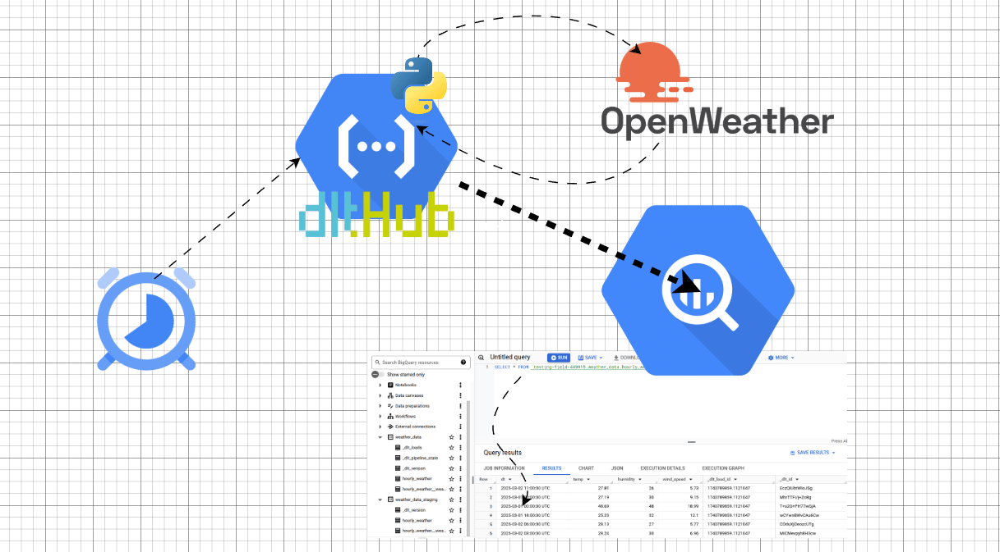

# Summary:
Data Piplene running in a cloud function that 
- Gets daily weather data from Open Weather API
- Loads it into Big Query using dlt

## Flow Diagram

## Steps to reproduce:
1) Create a Project on GCP
2) Generate an API Key from Open Weather
2) Copy the main.py and requirements.txt files from this repo into a local directory
3) Run the commands in the google_cli_commands document in the same directory as your code

## Walkthrough video:
